# TCO Application Architecture & Data Flow

## Overview
The Total Cost of Ownership (TCO) application is a Streamlit-based web application that compares battery electric vehicles (BEV) and diesel trucks. It follows a layered architecture with clear separation of concerns.

## Architecture Diagram

```mermaid
flowchart LR
    %% INPUTS SECTION
    subgraph Inputs["📥 INPUTS"]
        direction TB
        User([👤 User])
        
        subgraph UserInputs["User Interface"]
            Sidebar[Sidebar Controls<br/>• Vehicle Selection<br/>• Parameters<br/>• Scenarios]
            Pages[Navigation Pages<br/>• Home<br/>• Cost Breakdown<br/>• Sensitivity]
        end
        
        subgraph DataSources["Data Sources"]
            CSVFiles[CSV Data<br/>• Vehicle Models<br/>• Financial Params<br/>• Battery Specs<br/>• Charging Options<br/>• Infrastructure<br/>• Incentives]
        end
    end

    %% CALCULATIONS SECTION  
    subgraph Calculations["⚙️ CALCULATIONS"]
        direction TB
        
        subgraph Processing["Processing Layer"]
            Context[Context Management<br/>• Input Validation<br/>• Cache Management<br/>• Change Detection]
            Orchestrator[Calculation Orchestrator<br/>• Coordinates Flow<br/>• Applies Overrides]
        end
        
        subgraph CoreCalcs["Core Calculations"]
            TCOService[TCO Calculation Service]
            
            subgraph Domains["Domain Logic"]
                Finance[Finance<br/>• TCO & NPV<br/>• Acquisition Cost]
                Energy[Energy<br/>• Costs & Emissions<br/>• Charging Mix]
                Externalities[Externalities<br/>• Carbon Pricing<br/>• Social Costs]
                Sensitivity[Sensitivity<br/>• Parameter Analysis<br/>• Tornado Charts]
            end
        end
        
        subgraph DataAccess["Data Access"]
            Repositories[Repositories<br/>• Vehicle Data<br/>• Parameters<br/>• Scenarios]
        end
    end

    %% OUTPUTS SECTION
    subgraph Outputs["📤 OUTPUTS"]
        direction TB
        
        subgraph Results["Results"]
            Metrics[Key Metrics<br/>• TCO Comparison<br/>• Payback Period<br/>• Emissions Savings<br/>• Abatement Cost]
        end
        
        subgraph Visualisation["Visualisation"]
            Charts[Interactive Charts<br/>• Cost Breakdown<br/>• Sensitivity Analysis<br/>• Tornado Diagrams<br/>• Emissions Comparison]
        end
        
        subgraph Display["Display Components"]
            Components[UI Components<br/>• Metric Cards<br/>• Summary Tables<br/>• Interactive Controls]
        end
    end

    %% MAIN FLOW
    User --> Sidebar
    User --> Pages
    
    Sidebar --> Context
    CSVFiles --> Repositories
    
    Context --> Orchestrator
    Repositories --> Orchestrator
    
    Orchestrator --> TCOService
    TCOService --> Finance
    TCOService --> Energy  
    TCOService --> Externalities
    TCOService --> Sensitivity
    
    Finance --> Metrics
    Energy --> Metrics
    Externalities --> Metrics
    Sensitivity --> Charts
    
    Metrics --> Components
    Charts --> Components
    Components --> Pages

    %% Styling
    classDef inputStyle fill:#E8F5E9,stroke:#4CAF50,stroke-width:2px
    classDef calcStyle fill:#E3F2FD,stroke:#2196F3,stroke-width:2px  
    classDef outputStyle fill:#FFF3E0,stroke:#FF9800,stroke-width:2px
    classDef domainStyle fill:#F3E5F5,stroke:#9C27B0,stroke-width:2px
    
    class Inputs,UserInputs,DataSources,User,Sidebar,CSVFiles inputStyle
    class Calculations,Processing,CoreCalcs,DataAccess,Context,Orchestrator,TCOService,Repositories calcStyle
    class Outputs,Results,Visualisation,Display,Metrics,Charts,Components outputStyle
    class Domains,Finance,Energy,Externalities,Sensitivity domainStyle
```

## Data Flow Description

### 1. User Input Collection
1. User accesses the application through `main.py` which routes to different pages
2. **Sidebar Renderer** collects all user inputs:
   - Scenario selection
   - Vehicle selection (BEV model and comparison diesel)
   - Operating parameters (annual distance, vehicle lifetime)
   - Financial parameters (discount rate, fuel prices)
   - Charging configuration (single or mixed charging)
   - Infrastructure options
   - Fleet size and incentives

### 2. Context Building
1. **Context Builder** assembles UI context from inputs using builder pattern:
   - ScenarioBuilder
   - VehicleSelectionBuilder
   - ParameterInputBuilder
   - ChargingConfigurationBuilder
   - InfrastructureBuilder

2. **Input Hash** generates a hash of current inputs for cache invalidation

3. **get_context()** checks if inputs have changed:
   - If unchanged, returns cached results
   - If changed, triggers new calculations

### 3. Calculation Orchestration
1. **Calculation Orchestrator** coordinates the calculation flow:
   - Builds calculation requests for both BEV and diesel vehicles
   - Applies UI overrides to parameters
   - Calls TCO Calculation Service

### 4. Core Calculations
The **TCO Calculation Service** performs calculations in sequence:

1. **Energy Costs**:
   - Calculate energy cost per km
   - Calculate emissions (CO₂ per km, annual, lifetime)
   - Handle charging mix for BEVs

2. **Annual Costs**:
   - Energy costs
   - Maintenance costs
   - Registration and insurance
   - Apply operational incentives

3. **Acquisition Costs**:
   - Vehicle purchase price
   - Fees and taxes
   - Apply purchase incentives
   - Calculate residual value

4. **Battery Costs** (BEV only):
   - Battery degradation
   - Replacement costs with NPV

5. **Infrastructure Costs** (BEV only):
   - Charging infrastructure costs
   - Amortised per vehicle in fleet
   - Apply infrastructure incentives

6. **Externalities**:
   - Carbon emissions cost
   - Local air pollution costs
   - Noise pollution costs
   - Social TCO calculation

### 5. Comparison & Results
1. **Compare Vehicles**:
   - Calculate metrics for both BEV and diesel
   - Compute comparative metrics:
     - TCO savings
     - Payback period
     - Emissions reduction
     - Abatement cost

2. **Transform Results** for UI consumption

### 6. Visualisation
Results are displayed through:
- **Home Page**: Summary metrics and key comparisons
- **Cost Breakdown Page**: Detailed cost visualisations
- **Sensitivity Page**: Parameter sensitivity analysis

## Key Design Patterns

### Caching Strategy
- Input-based cache invalidation using hash
- Streamlit's `@st.cache_data` for data loading
- Session state for context caching

### Builder Pattern
- Used for constructing complex UI context
- Allows flexible parameter collection

### Repository Pattern
- Abstracts data access
- Enables future migration to different data sources

### Service Layer
- Encapsulates business logic
- Provides clean API for calculations

### Domain-Driven Design
- Clear separation of business domains
- Each module handles specific calculations

## Data Flow Optimisations

1. **Lazy Loading**: Data only loaded when needed
2. **Caching**: Results cached until inputs change
3. **Vectorised Operations**: Using pandas/numpy for calculations
4. **Modular Calculations**: Only recalculate what's needed

## Error Handling
- Custom exceptions (CalculationError, VehicleNotFoundError)
- Logging at each calculation step
- Graceful degradation for missing data 

## Data Workflow Diagram

```mermaid
flowchart TB
    %% DATA SOURCES LAYER
    subgraph Layer1["📁 DATA SOURCES"]
        CSVTables["CSV Tables
        • vehicle_models.csv
        • financial_params.csv
        • battery_params.csv
        • charging_options.csv
        • infrastructure_options.csv
        • incentives.csv
        • scenarios.csv
        • scenario_params.csv
        • externalities.csv
        • emission_factors.csv"]
        EnvConfig["Environment Config
        TCO_DATA_DIR"]
    end

    %% DATA LOADING LAYER
    subgraph Layer2["🔄 DATA LOADING"]
        TableRepo["TableRepository
        Protocol Interface"]
        CSVRepo["CSVRepository
        Filesystem Implementation"]
        DefaultRepo["_default_repository
        Factory Function"]
        LoadData["load_data
        @st.cache_data"]
    end

    %% DATA ACCESS LAYER  
    subgraph Layer3["🗃️ DATA ACCESS"]
        VehicleRepo["VehicleRepository
        • get_vehicle_by_id
        • get_fees_by_vehicle_id"]
        ParamsRepo["ParametersRepository
        • get_financial_params
        • get_battery_params
        • get_charging_options
        • get_infrastructure_options
        • get_incentives
        • get_externalities_data"]
        FinancialParams["FinancialParameters
        • diesel_price
        • discount_rate
        • carbon_price"]
        BatteryParams["BatteryParameters
        • replacement_cost_per_kwh
        • degradation_rate
        • minimum_capacity"]
    end

    %% SCENARIO PROCESSING LAYER
    subgraph Layer4["🎭 SCENARIO PROCESSING"]
        ScenarioService["Scenario Service
        apply_scenario_parameters"]
        ScenarioAppService["ScenarioApplicationService
        • parse_scenario_params
        • apply_modifications"]
        ModifiedTables["Modified Tables
        Scenario-Applied DataFrames"]
    end

    %% DATA TRANSFER OBJECTS LAYER
    subgraph Layer5["📦 DATA TRANSFER OBJECTS"]
        CalcParams["CalculationParameters
        • annual_kms
        • truck_life_years
        • discount_rate
        • charging_profile_id
        • infrastructure_id
        • fleet_size
        • UI overrides"]
        CalcRequest["CalculationRequest
        • vehicle_data
        • fees_data
        • parameters
        • all data tables"]
    end

    %% BUSINESS LOGIC LAYER
    subgraph Layer6["💼 BUSINESS LOGIC"]
        TCOService["TCO Calculation Service"]
        DomainModules["Domain Modules
        • Finance
        • Energy
        • Externalities
        • Sensitivity"]
    end

    %% RESULTS LAYER
    subgraph Layer7["📊 RESULTS"]
        TCOResult["TCOResult
        • tco_total_lifetime
        • cost breakdowns
        • emissions data
        • detailed breakdowns"]
        ComparisonResult["ComparisonResult
        • base_vehicle_result
        • comparison_vehicle_result
        • tco_savings
        • payback_period"]
    end

    %% VERTICAL DATA FLOW
    
    %% Layer 1 to Layer 2
    CSVTables --> CSVRepo
    EnvConfig --> DefaultRepo
    DefaultRepo --> CSVRepo
    CSVRepo --> TableRepo
    TableRepo --> LoadData
    
    %% Layer 2 to Layer 3
    LoadData --> VehicleRepo
    LoadData --> ParamsRepo
    LoadData --> FinancialParams
    LoadData --> BatteryParams
    
    %% Layer 3 to Layer 4
    LoadData --> ScenarioService
    ScenarioService --> ScenarioAppService
    ScenarioAppService --> ModifiedTables
    ModifiedTables --> VehicleRepo
    ModifiedTables --> ParamsRepo
    
    %% Layer 4 to Layer 5
    VehicleRepo --> CalcRequest
    ParamsRepo --> CalcRequest
    CalcParams --> CalcRequest
    
    %% Layer 5 to Layer 6
    CalcRequest --> TCOService
    TCOService --> DomainModules
    
    %% Layer 6 to Layer 7
    TCOService --> TCOResult
    DomainModules --> TCOResult
    TCOResult --> ComparisonResult

    %% STYLING
    classDef sourceStyle fill:#F0F9FF,stroke:#0EA5E9,stroke-width:2px
    classDef loadingStyle fill:#F0FDF4,stroke:#22C55E,stroke-width:2px
    classDef accessStyle fill:#FEF3C7,stroke:#F59E0B,stroke-width:2px
    classDef scenarioStyle fill:#ECFDF5,stroke:#10B981,stroke-width:2px
    classDef dtoStyle fill:#FEE2E2,stroke:#EF4444,stroke-width:2px
    classDef businessStyle fill:#EFF6FF,stroke:#3B82F6,stroke-width:2px
    classDef resultsStyle fill:#F3E8FF,stroke:#A855F7,stroke-width:2px
    
    class Layer1,CSVTables,EnvConfig sourceStyle
    class Layer2,TableRepo,CSVRepo,DefaultRepo,LoadData loadingStyle
    class Layer3,VehicleRepo,ParamsRepo,FinancialParams,BatteryParams accessStyle
    class Layer4,ScenarioService,ScenarioAppService,ModifiedTables scenarioStyle
    class Layer5,CalcParams,CalcRequest dtoStyle
    class Layer6,TCOService,DomainModules businessStyle
    class Layer7,TCOResult,ComparisonResult resultsStyle
```

## Data Workflow Description

### 1. **Data Sources (Blue)**
- **CSV Tables**: All reference data stored as CSV files in `tco_app/data/tables/`
- **Environment Config**: `TCO_DATA_DIR` environment variable for flexible data location

### 2. **Data Loading (Green)**
- **Repository Pattern**: `TableRepository` protocol with `CSVRepository` implementation
- **Factory Function**: `_default_repository()` creates repository with environment/default paths
- **Cached Loading**: `load_data()` with `@st.cache_data` loads all tables once per session

### 3. **Data Access (Yellow)**
- **Repository Layer**: `VehicleRepository` and `ParametersRepository` provide structured access
- **Specialised Access**: `FinancialParameters` and `BatteryParameters` with business-specific properties
- **Type Safety**: Strongly typed access to DataFrame data with defaults

### 4. **Scenario Processing (Light Green)**
- **Scenario Service**: Applies scenario parameter overrides
- **ScenarioApplicationService**: Parses and applies modifications to data tables
- **Modified Tables**: Scenario-adjusted DataFrames for calculations

### 5. **Business Logic (Light Blue)**
- **TCO Calculation Service**: Core calculation orchestration
- **Domain Modules**: Finance, Energy, Externalities, Sensitivity calculations

### 6. **Results (Red)**
- **TCOResult**: Single vehicle calculation results
- **ComparisonResult**: BEV vs diesel comparison metrics

## Key Data Flow Patterns

### **Caching Strategy**
- **Multi-level caching**: Streamlit, DataCache, Session State, Parameter repositories
- **Cache invalidation**: Input hash-based for context, LRU for DataCache
- **Performance optimisation**: Avoids repeated CSV loading and DataFrame operations

### **Repository Pattern**
- **Abstraction**: Clean interface over raw DataFrames
- **Flexibility**: Can swap CSV for database/API without changing business logic
- **Type Safety**: Structured access with defaults and validation

### **DTO Pattern**
- **Data bundling**: Clean interfaces between layers
- **Type safety**: Structured data with validation
- **Immutability**: Dataclasses prevent accidental modification

### **Scenario Override**
- **Non-destructive**: Original data preserved, modifications applied to copies
- **Targeted**: Vehicle type and drivetrain-specific overrides
- **Traceable**: Applied modifications tracked for debugging 